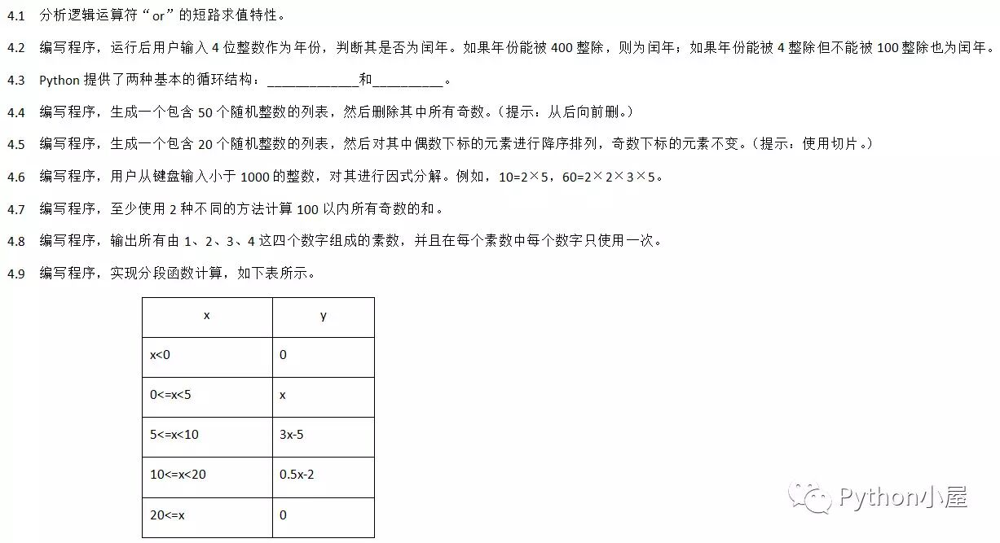

# 题目




# 答案

## 4.2
```python
"""
 * Project name(项目名称)：Python考试题
 * Package(包名): 
 * File(文件名): test1
 * Author(作者）: mao
 * Author QQ：1296193245
 * GitHub：https://github.com/maomao124/
 * Date(创建日期)： 2022/6/6 
 * Time(创建时间)： 14:12
 * Version(版本): 1.0
 * Description(描述)： 4.2
 """

if __name__ == '__main__':
    inputYear = input("请输入年份:")
    inputYear = eval(inputYear)
    if inputYear < 0:
        print("输入错误")
        exit(0)
    if inputYear % 400 == 0 or (inputYear % 4 == 0 and not inputYear % 100 == 0):
        print("是闰年")

    else:
        print("不是闰年")

```


## 4.4 
```python
"""
 * Project name(项目名称)：Python考试题
 * Package(包名): 
 * File(文件名): test2
 * Author(作者）: mao
 * Author QQ：1296193245
 * GitHub：https://github.com/maomao124/
 * Date(创建日期)： 2022/6/6 
 * Time(创建时间)： 14:21
 * Version(版本): 1.0
 * Description(描述)： 4.4
 """
import random

if __name__ == '__main__':
    x = [random.randint(0, 100) for i in range(50)]
    print(x)

    for i in range(len(x))[::-1]:
        if x[i] % 2 == 1:
            del x[i]

    print(x)

```

## 4.5 

```python
"""
 * Project name(项目名称)：Python考试题
 * Package(包名): 
 * File(文件名): test3
 * Author(作者）: mao
 * Author QQ：1296193245
 * GitHub：https://github.com/maomao124/
 * Date(创建日期)： 2022/6/6 
 * Time(创建时间)： 14:29
 * Version(版本): 1.0
 * Description(描述)： 4.5
 """
import random

if __name__ == '__main__':
    x = [random.randint(0, 100) for i in range(20)]
    print(x)

    x[::2] = sorted(x[::2], reverse=True)

    print(x)

```

## 4.6 
```python
"""
 * Project name(项目名称)：Python考试题
 * Package(包名): 
 * File(文件名): test4
 * Author(作者）: mao
 * Author QQ：1296193245
 * GitHub：https://github.com/maomao124/
 * Date(创建日期)： 2022/6/6 
 * Time(创建时间)： 14:32
 * Version(版本): 1.0
 * Description(描述)： 4.6
 """

if __name__ == '__main__':
    x = input("请输入小于1000的整数：")
    x = eval(x)
    t = x
    i = 2
    result = []
    while True:
        if t == 1:
            break
        if t % i == 0:
            result.append(i)
            t = t // i
        else:
            i += 1

    print(x, "=", "*".join(map(str, result)))

```


## 4.7 
```python
"""
 * Project name(项目名称)：Python考试题
 * Package(包名): 
 * File(文件名): test5
 * Author(作者）: mao
 * Author QQ：1296193245
 * GitHub：https://github.com/maomao124/
 * Date(创建日期)： 2022/6/6 
 * Time(创建时间)： 14:40
 * Version(版本): 1.0
 * Description(描述)： 4.7
 """

if __name__ == '__main__':
    print(sum([i for i in range(1, 100) if i % 2 == 1]))
    print(sum(range(1, 100)[::2]))

```

